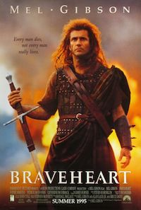
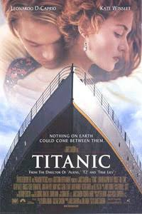
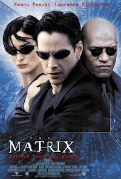

footer: © NodeProgram.com, Node.University and Azat Mardan 2017
slidenumbers: true

# Top ES6/ES2015 Features
## Intro

Azat Mardan @azat_co

---

# Brief History of JavaScript

---

## Before: JavaScript is NOT a real language

^In the past, I would often hear doubts from software engineers (especially pure back-end developers) whether JavaScript be a workable programming language. They would instead favor languages such as Java, Python or C++.

---

## Now: JavaScript is THE language

^No. More! JavaScript is everywhere, in web, IoT, servers, cloud and mobile!

---

### ECMAScript6/ECMAScript2015+! 🚆

^It’s fair to say, early JavaScript had its [quirks](http://archive.oreilly.com/pub/a/javascript/excerpts/javascript-good-parts/bad-parts.html), but ES6 represents a significant move forward for JavaScript.

---

## A brief JavaScript timeline

^Let’s look at the history of the language... "those who don't know the history can't make it."- said SOMEONE smart.

---

### 1995: JavaScript is born as LiveScript at Netscape

---

### 1997: ECMAScript standard is established by European Computer Manufacturers Association (ECMA)

---

### 1999: ES3 comes out and IE5 is all the rage; the most popular debugging method is `alert(error);`

---

### 2000-2005: `XMLHttpRequest`, a.k.a. AJAX, gains popularity in app such as Outlook Web Access (2000) and Oddpost (2002), Gmail (2004) and Google Maps (2005)

---

### 2009: ES5 comes out (this is what most of us use now) with `forEach`, `Object.keys`, `Object.create` (specially for [Douglas Crockford](http://www.crockford.com)), and standard JSON

---

### 2015: ES6/ECMAScript2015 comes out fixing a lot of bad parts

---

### 2016: ES7 is on the [final](http://www.2ality.com/2016/01/ecmascript-2016.html)

---

### 2017: ES8 is on the [horizon](http://www.2ality.com/2016/02/ecmascript-2017.html)

---

# Problem with JavaScript

---

### Backwards compatibility: Cannot break the old features

---

### Enough with this JavaScript history lesson

---

# ECMAScript

---

### ECMAScript (or ES) is a trademarked scripting-language specification

^ ECMAScript was standardized by Ecma International in ECMA-262 and ISO/IEC 16262.

---

### ECMA is  European Computer Manufacturers Association (ECMA)

---

### Who designs ECMAScript?

---

### TC39: Technical Committee 39

---

### TC39 Consists of Implementers

* Mozilla
* jQuery
* Google
* Microsoft
* Apple

For example: [Dec 1, 2016 Meeting notes](https://github.com/rwaldron/tc39-notes/blob/master/es7/2016-11/dec-1.md#december-1-2016-meeting-notes)

---

### ES6 is large... ES7+ smaller+more often.

^Starting with ECMAScript 2016 (ES7), releases will happen more frequently and be much smaller as a consequence. There will be one release per year and it will contain all features that are finished by a yearly deadline.

---

# 4 Stages

---

## Stage 0: Strawman

^A free-form way of submitting ideas for evolving ECMAScript. Submissions must come either from a TC39 member or a non-member who has registered as a TC39 contributor.

---

## Stage 1: Proposal

^A formal proposal of the feature.

---

## Stage 2: Draft

^The proposal was accepted and this is the work in progress implementation.

---

## Stage 3: Candidate

^The proposal is done and getting feedback from implementers and users/developers.

---

## Stage 4: finished

^The proposal is included in the standard.

---

# ES6 Syntax vs Language Features

^In this course, I brokedown top ES6 features into two categories

---

### Syntax Features: Sugarcoating or aliases or shortcuts

1. Block-Scoped Constructs: Let and Const
1. Default Parameters
1. Rest and Spread Parameters
1. Template Literals
1. Multi-line Strings
1. Destructuring Assignment
1. Arrow Functions 8. For Of Comprehensions

---

### Language Features: More advanced and complex features

1. Promises
1. Enhanced Object Literals
1. Classes
1. Modules

---

# Onward! 🚀