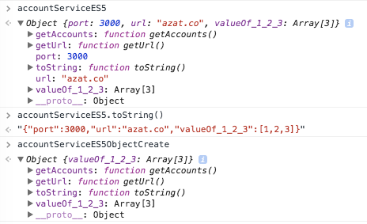
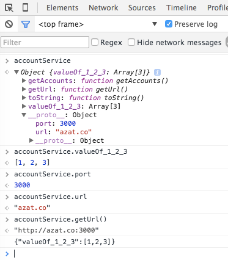

footer: © NodeProgram.com, Node.University and Azat Mardan 2017
slidenumbers: true

# Top ES6/ES2015 Features
## Section 3: Language Features


Azat Mardan @azat_co


---

# Promises

---


### Promises flame wars! 🔥

^Promises have been a controversial development topic.

---

* q
* bluebird
* deferred.js
* vow
* avow
* jquery deferred...

^One reason for this is the number of promise implementations using slightly different syntaxes. To name just a few: q, bluebird, deferred.js, vow, avow, and jquery deferred to name just a few.

---

### Promises? Meh 😏

^Another reason is that some software engineers say, "We don't need promises and can just use async, generators, callbacks, etc".

---

### ES6 Promises!


^Gladly, there's a chance the debates will quiet down with the standard `Promise` implementation added to ES6!

---

Let's consider a rather trivial example of a delayed asynchronous execution with `setTimeout()`:

```js
setTimeout(function(){
  console.log('Yay!')
}, 1000)
```

---

We can re-write this code in ES6 with Promise:

```js
var wait1000 =  new Promise(function(resolve, reject) {
  setTimeout(resolve, 1000)
}).then(function() {
  console.log('Yay!')
})
```

---

Or with ES6 arrow functions and `const` (can be `let` or `var`):

```js
const wait1000 =  new Promise((resolve, reject) => {
  setTimeout(resolve, 1000)
}).then(() => {
  console.log('Yay!')
})
```

---

If we have more nested logic inside of the `setTimeout()` callback in ES5 code:

```js
setTimeout(function(){
  console.log('Yay!')
  setTimeout(function(){
    console.log('Wheeyee!')
  }, 1000)
}, 1000)
```

---

It can be re-written with ES6 promises like so:

```js
var wait1000 =  () =>  // you can pass args
  new Promise((resolve, reject) => {
    setTimeout(resolve, 1000)
  })

wait1000()
  .then(() => {
    console.log('Yay!')
    return wait1000()
  })
  .then(() => {
    console.log('Wheeyee!')
  })
```

---

### As you can observe, the code organization changed when we refactored callbacks-only code into code with Promises.

---

### Another benefit not covered in this essay — Promises have a fail-and-catch-all callback as well which is a nice feature.

---

[axios](https://github.com/mzabriskie/axios) example:

```js
const request = require('axios')
request.get(url)
  .then(response => response.data)
  .then(messages => {
    console.log(messages)
    if(!messages || !messages.length){
      throw 'Message is empty'
    }
    this.setState({messages: messages}) // React method
  })
  .catch( (error) {
    console.log(error)
  })  
```  

---

### Take a look at this post for more info on Promises: [*Introduction to ES6 Promises*](http://jamesknelson.com/grokking-es6-promises-the-four-functions-you-need-to-avoid-callback-hell).

---

# Enhanced Object Literals

---


### What you can do with object literals in ES6 is mind blowing!

---

### ES6 object literals are not a version of JSON (ES5) but something closely resembling classes!

---

Here's a typical ES5 object literal with some methods and attributes/properties:

```js
var serviceBase = {port: 3000, url: 'azat.co'},
    getAccounts = function(){return [1,2,3]}

var accountServiceES5 = {
  port: serviceBase.port,
  url: serviceBase.url,
  getAccounts: getAccounts,
  toString: function() {
    return JSON.stringify(this.valueOf())
  },
  getUrl: function() {return "http://" + this.url + ':' + this.port},
  valueOf_1_2_3: getAccounts()
}
```

---

If we want to be fancy, we can inherit from `serviceBase` by making it the prototype with the `Object.create` method:

```js
var accountServiceES5ObjectCreate = Object.create(serviceBase)
accountServiceES5ObjectCreate = Object.assign(accountServiceES5ObjectCreate,
  {
    getAccounts: getAccounts,
    toString: function() {
      return JSON.stringify(this.valueOf())
    },
    getUrl: function() {return "http://" + this.url + ':' + this.port},
    valueOf_1_2_3: getAccounts()
  }
)
```

---

### `accountServiceES5 !== accountServiceES5ObjectCreate`




`accountServiceES5ObjectCreate` have the `port` and `url` properties in the `__proto__` object vs. instance like `accountServiceES5`.

---

### In ES6 object literals, we can use shorthands for method assignment. For example, `getAccounts: getAccounts,` becomes just `getAccounts,`.

---

We can also set the prototype right there in the `__proto__` property  (not `'__proto__'` though). For example, `serviceBase` is a prototype:

```js
var serviceBase = {port: 3000, url: 'azat.co'},
  getAccounts = function() {return [1,2,3]}
var accountService = { // or const or let
  __proto__: serviceBase, // extend from another object
  getAccounts, // no name duplication
```

---

Also, we can invoke `super` and have dynamic keys. For example, `toString()` method returns a JSON object as a string by calling `super.valueOf()`, and `valueOf_1_2_3` is a dynamic property name:

```js
  toString() { // no "function"
    return JSON.stringify((super.valueOf()))
  },
  getUrl() {return "http://" + this.url + ':' + this.port},
    [ 'valueOf_' + getAccounts().join('_') ]: getAccounts()
}
console.log(accountService)
```

---




```js
var serviceBase = {port: 3000, url: 'azat.co'}, // or const
  getAccounts = function(){return [1,2,3]}
var accountService = {
  __proto__: serviceBase,
  getAccounts,
  toString() {
    return JSON.stringify((super.valueOf()))
  },
	getUrl() {return "http://" + this.url + ':' + this.port},
    [ 'valueOf_' + getAccounts().join('_') ]: getAccounts()
}
console.log(accountService)
```

---

### This is a great enhancement to good old object literals, because developers can pack more logic and do more things than with ES5 objects!

---

# Classes

---


### If you love object-oriented programming (OOP), then you'll love this feature. It makes writing classes in ES6, and inheriting from them, as easy as liking a comment on Facebook.

---

### In ES5, classes creation and usage was difficult to say the least.

---

### There wasn't a keyword `class` (it was reserved, but did nothing). In addition to that, lots of inheritance patterns like [pseudo classical](http://javascript.info/tutorial/pseudo-classical-pattern), [classical](http://www.crockford.com/javascript/inheritance.html), [functional](http://javascript.info/tutorial/factory-constructor-pattern) just added to the confusion, pouring gasoline on the fire of  JavaScript [flame](https://en.wikipedia.org/wiki/Flaming_(Internet) wars.

---

### I won't show you how to write a class in ES5, because there are many patterns. Let's take a look at the ES6 example right away.

---

I can tell you that the ES6 class will use prototypes, not the function factory approach. We have a class `baseModel` in which we can define a `constructor` and a `getName()` method:

```js
class baseModel {
  constructor(options = {}, data = []) { // class constructor
  	this.name = 'Base'
    this.url = 'http://azat.co/api'
  	this.data = data
    this.options = options
  }
  getName() { // class method
    console.log(`Class name: ${this.name}`)
  }
}
```

^Notice that I'm using default parameter values for options and data. Also, method names don't need to have the word `function` or the colon (`:`) anymore. The other big difference is that you can't assign properties `this.NAME` the same way as methods, i.e., you can't say `name` at the same indentation level as a method. To set the value of a property, simply assign a value in the constructor.

---

The `AccountModel` will inherit from `baseModel` with `class NAME extends PARENT_NAME`:

```js
class AccountModel extends baseModel {
  constructor(options, data) {
    super({private: true}, ['32113123123', '524214691']) // Call the parent method with super
    this.name = 'Account Model'
    this.url +='/accounts/'
  }
}
let accounts = new AccountModel()
```

^To call the parent constructor, effortlessly invoke `super()` with params.

---

If you want to be really fancy, you can also set up a getter like this with `accountsData` as a property:

```js
class AccountModel extends baseModel {
  get accountsData() { // Calculated attribute getter
    // ... make XHR
    return this.data
  }
}
```

---

### So after *all this work*, how do you actually use this class abracadabra? It's as easy as tricking a three-year old into believing in Santa Claus. Use `new` operand:


```js
let accounts = new AccountModel(5)
accounts.getName()
console.log('Data is %s', accounts.accountsData)
```

In case you're wondering, the output is:

```
Class name: Account Model
Data is %s 32113123123,524214691
```

---

## No class attributes!

---

```js
class AccountModel extends baseModel {
  ...
}
AccountModel.PropTypes = { // outside!
  ...
}
```

---

### Of course, [classes existed in CoffeeScript ](http://webapplog.com/coffeescript-fundamentals-the-better-javascript/) and older JavaScript standards so they are not completely new.

---

### However in ES6, using classes is easier than before, and this is especially important for enterprise developers because they typically work on larger projects which span multiple teams (so the code requires modularization).

---

# Modules

---

### As you might know, there was NO native modules support in JavaScript before ES6.

---


### People came up with AMD, RequireJS, CommonJS and other workarounds but they were just that—workaround and hacks. With ES6 there are now built-in modules with `import` and `export` operands.

---

### In ES5, you would use `<script>` tags with IIFE, or a library like AMD, while in ES6 you can expose your class with `export`.

---

### Since I'm a Node.js guy, so I'll use CommonJS which is also a Node.js syntax to solve this problem.

---

### It's fairly straightforward to use CommonJS on the browser with the [Browserify](http://browserify.org) bundler.

---

With CommonJS/Node and a tool like Webpack or Browserify, we can use `module.exports`, i.e., have `port` variable and `getAccounts` method in a `module.js` file:

```js
module.exports = {
  port: 3000,
  getAccounts: function() {
    ...
  }
}
```

In ES5 `main.js`, we would `require('module')` that dependency:

```js
var service = require('module.js')
console.log(service.port) // 3000
```

---

## Let's see how ES6 modules are different from `<script>` or `require`.

---

In ES6, we would use `export` and `import`. For example, this is our library in the ES6 `module.js` file:

```js
export var port = 3000
export function getAccounts(url) {
  ...
}
```

---

In the importer ES6 file `main.js`, we use `import {name} from 'my-module'` syntax. For example, we can import objects/methods `port`, and `getAccounts` from the module called module:

```js
import {port, getAccounts} from 'module'
console.log(port) // 3000
```

---

Or we can import everything as a variable `service` in `main.js`:

```js
import * as service from 'module'
console.log(service.port) // 3000
```

---

# ES6 Modules

* Support for static analysis tools
* Standard

Cons

* No dynamic loading, i.e., need to now the name of the module before hand
* No implementations (as of Jan, 2017)
* Not working in Node


---

### Note, that native support for ES6 modules in the browsers is not coming anytime soon (as of this recording - Jan, 2017).

---

### So you'll need something like Babel or [jspm](http://jspm.io) to utilize ES6 modules by converting ES6 module code into Node/CommonJS code.

---

### For more information and examples on ES6 modules, take a look at [this text](http://exploringjs.com/es6/ch_modules.html). And remember, —no matter what, write modular JavaScript!

---

## The End of Section 3 👏