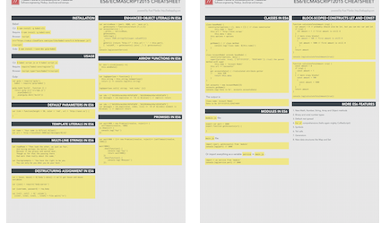
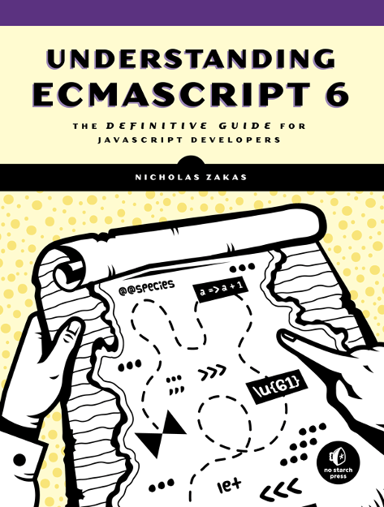
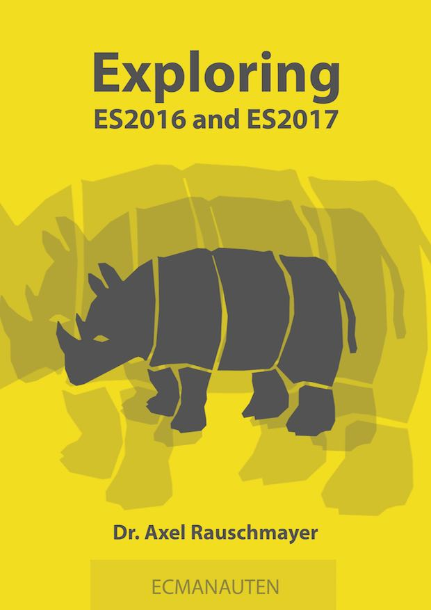

footer: © NodeProgram.com, Node.University and Azat Mardan 2017
slidenumbers: true

# Top ES6/ES2015 Features
## Outro

Azat Mardan @azat_co

---

# ES6 is about DX/convenience.

---

# Further Study

---

# ES6/ES2015 Cheatsheet:

* Free online: <https://github.com/azat-co/cheatsheets/tree/master/es6>
* Free PDF: <https://node.university/p/library>

---

### *Understanding ECMAScript 6* by Nicolas Zakas book:

* <https://leanpub.com/understandinges6>
* <https://www.nostarch.com/ecmascript6>

---

### *Exploring ES6* by Dr. Axel Rauschmayer:

* Free online: <https://leanpub.com/exploring-es6>

---

# ES7/ES2016

---

### ES7/ES2016: Only two features 😕

---

### The exponentiation operator (**)

---

### `Array.prototype.includes`

---

### Read for free online at <http://exploringjs.com/es2016-es2017/>

---

### ES.Next is a dynamic name that refers to whatever the next version is at time of writing.

---

### ES.Next features are more correctly called proposals, because by definition the specification has not been finalized yet

---

# ES.Next

* <https://github.com/esnext/esnext>
* <http://kangax.github.io/compat-table/esnext>
* <http://esnextnews.com>

---

## Now, go ahead and teach ES6 to others! 🏁

---

## The End