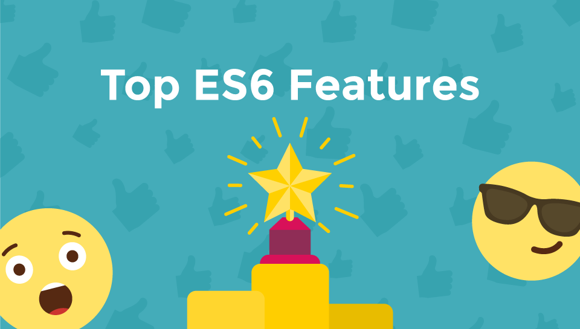

# Top ES6/ES2015 Features

* Videos: <http://node.university/p/es6>
* Slides: in `*.md` here
* Code: in `code` here

---

# TOC

---

## Section 1: Intro

1. Brief History of JavaScript
1. ECMAScript
1. Syntax vs Language Features

---

## Section 2: Syntax Features

1. Block-Scoped Constructs: Let and Const
1. Default Parameters
1. Rest and Spread Parameters
1. Template Literals
1. Multi-line Strings
1. Destructuring Assignment
1. Arrow Functions
1. For Of Comprehensions

---

## Section 3: Language Features

1. Promises
1. Enhanced Object Literals
1. Classes
1. Modules

---

## Section 4: Babel

1. What is Babel
1. Using Babel CLI

---

## Section 5: Outro

1. Further Reading
1. ES 7
1. ES Next
